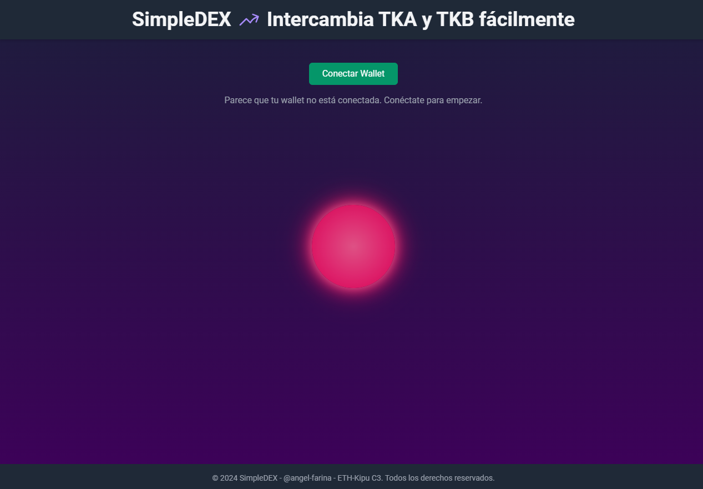
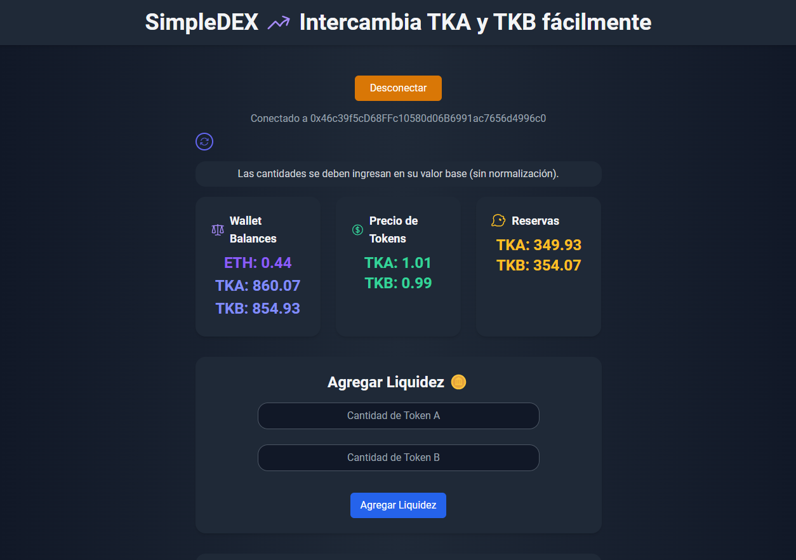
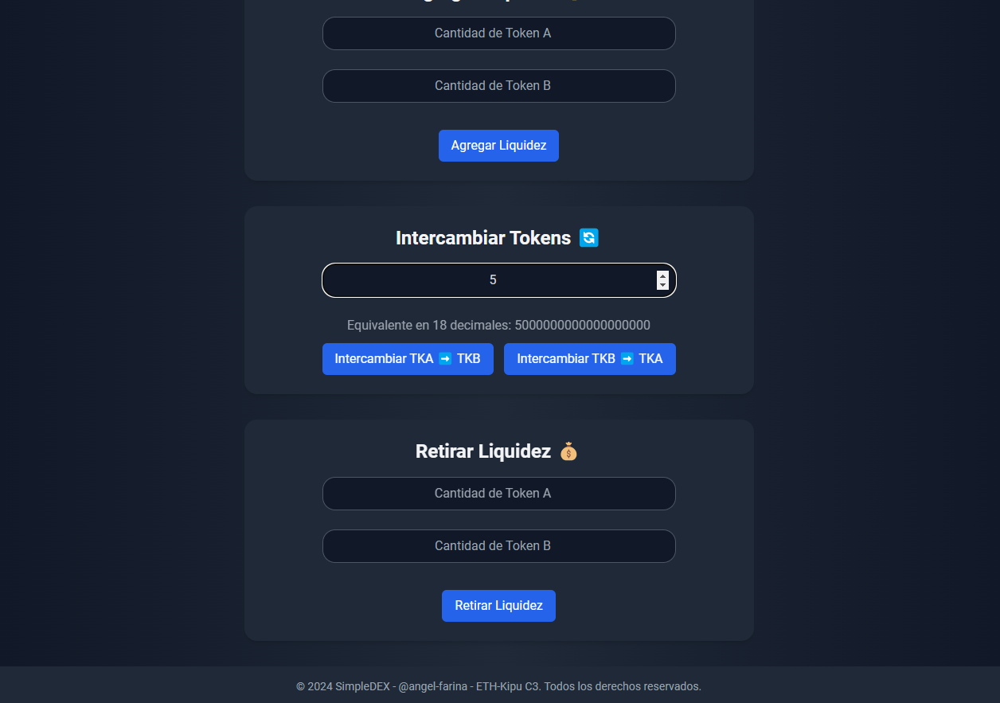

# SimpleDEX Front-end ETH-Kipu_C3_Mod4_TF 🌐

**SimpleDEX** es una aplicación descentralizada (dApp) que permite a los usuarios intercambiar tokens y gestionar liquidez en un contrato inteligente. Está desplegado en la red de prueba **Sepolia** y permite realizar operaciones con los tokens **TKA** y **TKB**, cada uno respaldado por su propio contrato inteligente.

La plataforma se enfoca en ofrecer una experiencia de usuario sencilla y fluida, con un diseño visual moderno y funcionalidades clave para interactuar con la blockchain.

---

## 🚀 Características

1. **Agregar Liquidez**:  
   Los usuarios pueden aportar liquidez al pool con cantidades específicas de **TKA** y **TKB**. Esto mejora la capacidad del contrato para realizar intercambios eficientes.

2. **Retirar Liquidez**:  
   Permite a los usuarios recuperar parcial o totalmente su aporte al pool de liquidez.

3. **Intercambiar Tokens**:  
   Intercambia fácilmente entre `TKA ➡️ TKB` y `TKB ➡️ TKA` con precios calculados dinámicamente en tiempo real.

4. **Consultar Balances y Precios**:  
   Visualiza el balance de la wallet conectada, las reservas del pool y los precios actuales de los tokens.

5. **Efectos Estéticos**:  
   Fondo animado con efectos visuales que crean una experiencia moderna y atractiva.

---

## 🛠️ Tecnologías utilizadas

### **Frontend**:
- **HTML5**, **CSS3**, **JavaScript (ES6+)**.
- Estilos con **[TailwindCSS](https://tailwindcss.com/)** para un diseño responsivo y limpio.
- Fuentes de **[Google Fonts](https://fonts.google.com/)** (Roboto).
- Animaciones personalizadas con **CSS**.

### **Backend**:
- Contrato inteligente `SimpleDEX` desarrollado en **Solidity**.  
  Desplegado en la red de prueba **Sepolia**, el contrato permite:
  - Intercambiar **TKA** y **TKB**, cada uno con su propio contrato ERC-20.
  - Gestionar reservas de los tokens en el pool de liquidez.
  - Calcular precios de intercambio dinámicos.

### **Conexión Blockchain**:
- **[Ethers.js](https://docs.ethers.org/)**: Librería para interactuar con contratos inteligentes en Ethereum.

### **Wallet**:
- **[MetaMask](https://metamask.io/)**: Utilizado para conectar wallets y autorizar transacciones.

---

## 🖥️ Requisitos previos

- Tener instalada la extensión de **[MetaMask](https://metamask.io/)**.
- Una cuenta de prueba en la red **Sepolia** con fondos:
  - **ETH** para pagar el gas.
  - Tokens **TKA** y **TKB** compatibles con ERC-20.

---

## 🎨 Vista previa

## Deploy

